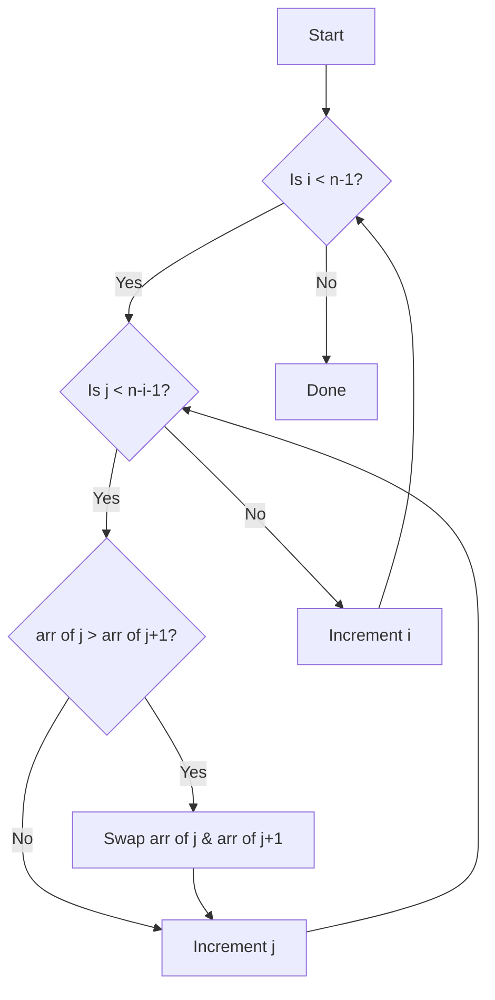
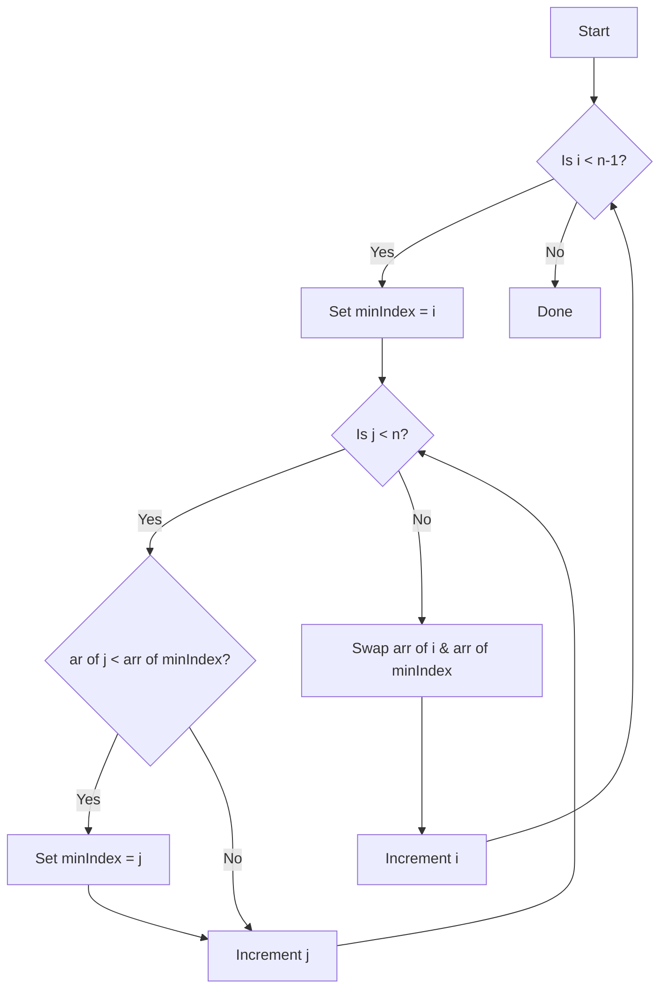
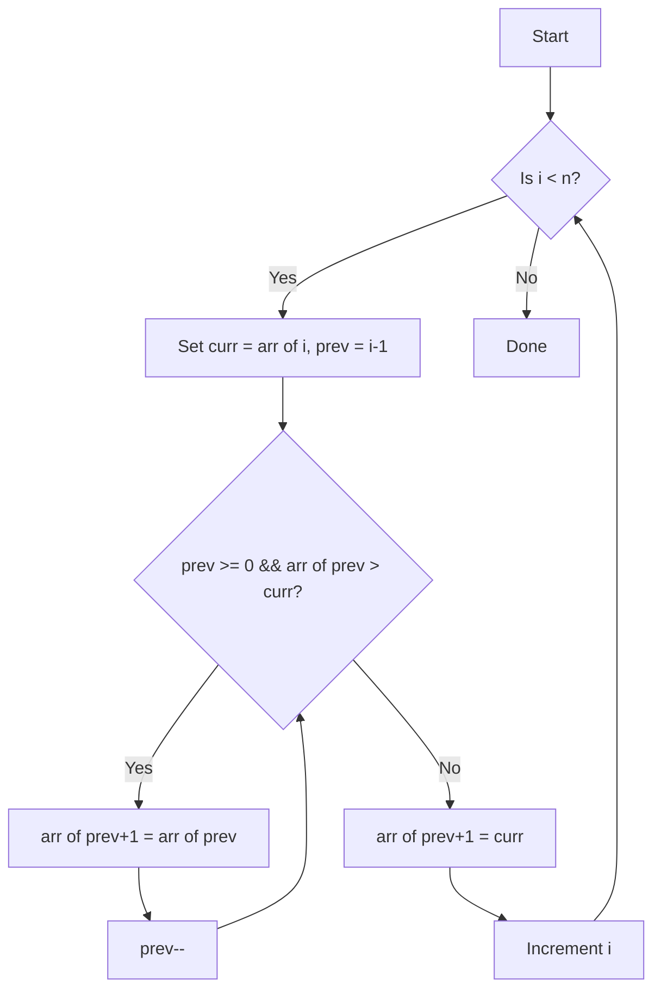

## Bubble Sort

```mermaid
flowchart TD
    A[Start] --> B{Is i < n-1?}
    B -->|Yes| C{Is j < n-i-1?}
    C -->|Yes| D{arr of j > arr of j+1?}
    D -->|Yes| E[Swap arr of j & arr of j+1]
    D -->|No| F[Increment j]
    E --> F
    F --> C
    C -->|No| G[Increment i]
    G --> B
    B -->|No| H[Done]
```
## Selection Sort

```mermaid
flowchart TD
    A[Start] --> B{Is i < n-1?}
    B -->|Yes| C[Set minIndex = i]
    C --> D{Is j < n?}
    D -->|Yes| E{ar of j < arr of minIndex?}
    E -->|Yes| F[Set minIndex = j]
    E -->|No| G[Increment j]
    F --> G
    G --> D
    D -->|No| H[Swap arr of i & arr of minIndex]
    H --> I[Increment i]
    I --> B
    B -->|No| J[Done]
```
## Insertion Sort

```mermaid
flowchart TD
    A[Start] --> B{Is i < n?}
    B -->|Yes| C[Set curr = arr of i, prev = i-1]
    C --> D{prev >= 0 && arr of prev > curr?}
    D -->|Yes| E[arr of prev+1 = arr of prev]
    E --> F[prev--]
    F --> D
    D -->|No| G[arr of prev+1 = curr]
    G --> H[Increment i]
    H --> B
    B -->|No| I[Done]
```
  
