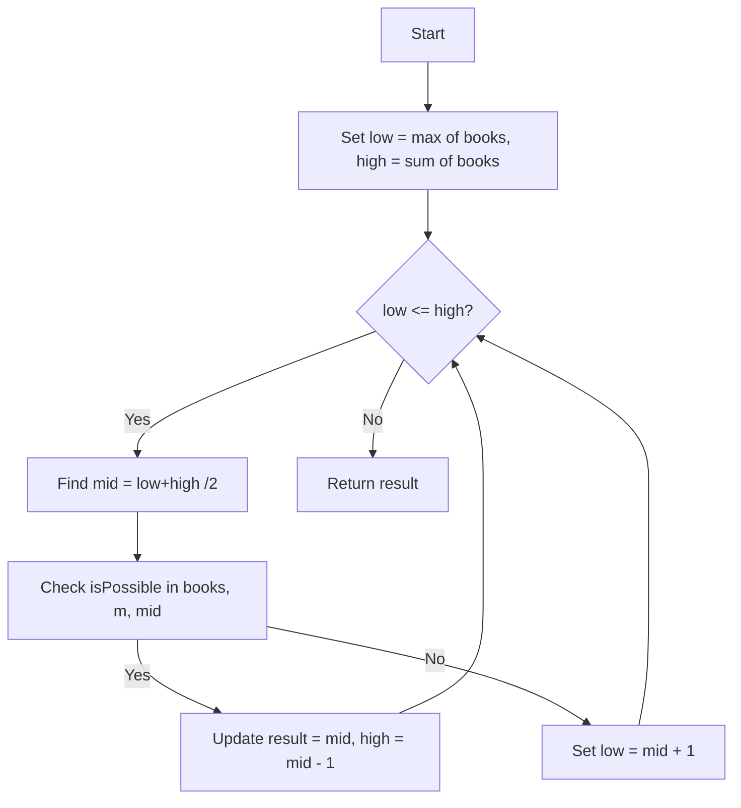

## What is Binary Search on the Answer?
Instead of searching in the array directly, you're searching for the best possible answer within a range.
You're asking: "Is it possible to achieve X?"

If yes → try a better (smaller/larger) answer.

If no → discard that part of the range.

### Use Case Examples:
Book/Page Allocation

Painter Partition Problem

Minimum Maximum of Jobs

Aggressive Cows

Capacity to Ship Packages

Split Array Largest Sum

## How does it work here?
We aren't searching in the array. We're searching for the smallest possible maximum sum such that the array can be split into k or fewer subarrays.

Let’s break this down:

🔸 Step 1: Define search space
The minimum possible max subarray sum is the largest single number in the array (max(nums)), because you can’t split a book (or array element).

The maximum possible max subarray sum is the sum of all elements (sum(nums)), if you don't split at all.

🔸 Step 2: Binary search on this range
We perform binary search between [max(nums), sum(nums)].

🔸 Step 3: Use a greedy helper function
For a given candidate max sum mid, we:

Try to split the array into as few parts as possible such that no part exceeds mid.

Count how many parts we end up with.

If we can split into ≤ k parts ⇒ ✅ valid solution, try smaller. If we need > k parts ⇒ ❌ invalid, try bigger.

