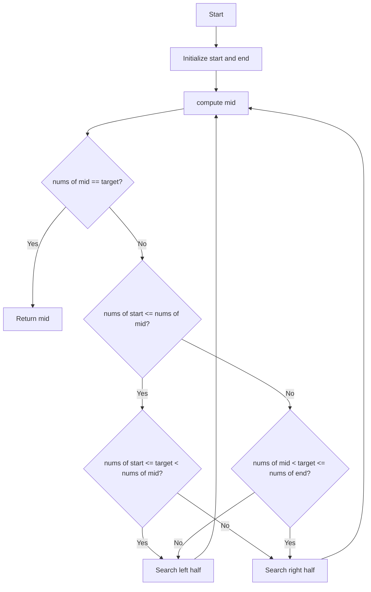

```mermaid
flowchart TD
    A[Start] --> B[Initialize start and end]
    B --> C[compute mid]
    C --> D{nums of mid == target?}
    D -- Yes --> E[Return mid]
    D -- No --> F{nums of start <= nums of mid?}
    F -- Yes --> G{nums of start <= target < nums of mid?}
    G -- Yes --> H[Search left half]
    G -- No --> I[Search right half]
    F -- No --> J{nums of mid < target <= nums of end?}
    J -- Yes --> I
    J -- No --> H
    H --> C
    I --> C
```
